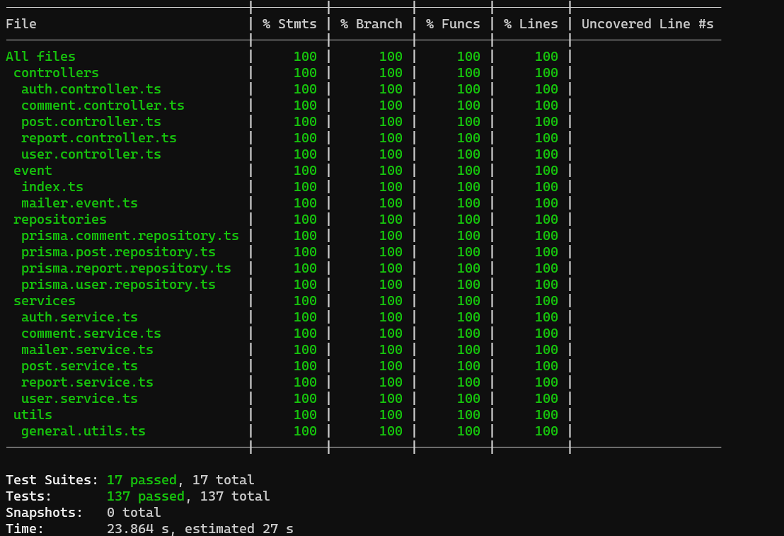

# Microblog API

## Installation Steps

1. git clone repo.
2. run command `npm install`.
3. run command `npm run docker:up` to create database with docker.
4. run command `npx prisma migrate dev` to apply migration to database.
5. create `.env file` with enviroment variable (more details `.env.example`).

## Documentation postman

Documentation postman [here](https://documenter.getpostman.com/view/24300106/2s93sW9w4X)

## Mandatory features

- [x] A user can create, update, delete or read posts.

  - Users can only update or delete posts that belong to them.
  - Users need to be authenticated to create a post.
  - Users do not need to be authenticated to read a post.
  - Users can create a post as a draft.

- [x] A user can create, update, delete or read comments.

  - Users can only update or delete comments that belong to them.
  - Users need to be authenticated to create a comment.
  - Users do not need to be authenticated to read a comment.
  - Users can create a comment as a draft.

- [x] An authenticated user can like/dislike a post.

- [x] An authenticated user can like/dislike a comment.

- [x] An authenticated user can update their profile and only their profile.

- [x] An authenticated user can decide if they want their email to be public.

- [x] An authenticated user can decide if they want their real name to be public.

- [x] On creating an account, the user's email needs to be verified by sending an email.

- [x] OpenAPI (aka Swagger) / Postman documentation

- [x] Tests, at least a coverage of 80%

## Extra points

- [x] Create report Comments
- [x] Create report Posts

## Test coverage

